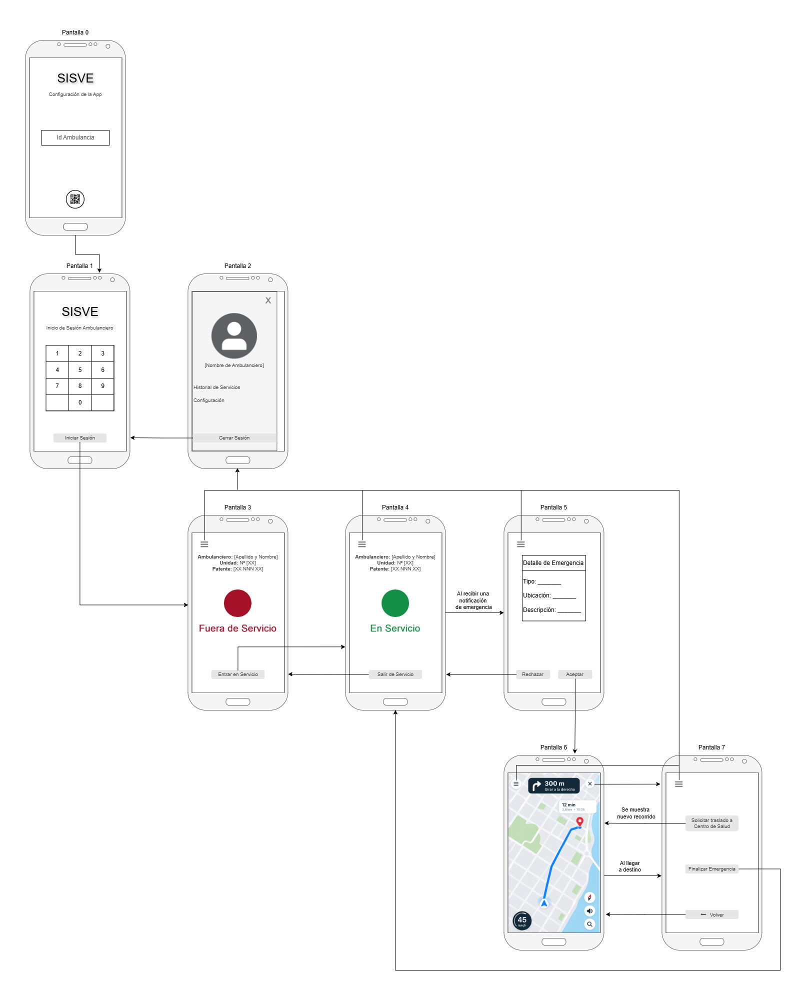

# 🚑 SISVE

Sistema de Información y Seguimiento de Vehículos de Emergencia (SISVE)

Aplicación móvil desarrollada para la gestión y seguimiento de ambulancias, permitiendo centralizar el estado de los vehículos de emergencia, recibir despachos, transmitir su ubicación y facilitar la respuesta ante situaciones de emergencia.

> Proyecto desarrollado en el marco de la materia Desarrollo de Aplicaciones para Dispositivos Móviles de la Universidad Tecnológica Nacional - Facultad Regional Buenos Aires (UTN.FRBA).
> 
> Integrantes del Equipo:
> + Dalessio Poisson, Pedro
> + García Frigo, Manuel
> + Herrera, Federico
> + Jugo, Germán Ignacio
> + Martínez, Julián Ezequiel
> + Scarazzato, Ruben Omar

## 📱 Descripción

SISVE es una aplicación Android destinada a ser utilizada en ambulancias para gestionar su operación durante el servicio.

La aplicación permite identificar la ambulancia asociada al dispositivo, autenticar al usuario mediante un PIN, mantener actualizado el estado de la unidad y transmitir periódicamente su ubicación.

Además, ante un nuevo despacho de emergencia, la aplicación puede recibir una notificación y presentar al operador la información necesaria para aceptar o rechazar el llamado y dirigirse al lugar correspondiente.

## 🎯 Objetivos

Los principales objetivos del proyecto son:

Gestionar la identidad de cada ambulancia.

Proporcionar un mecanismo de autenticación mediante PIN.

Registrar los accesos a la aplicación.

Mantener actualizado el estado de la ambulancia.

Obtener y transmitir periódicamente la ubicación GPS.

Recibir despachos de emergencia mediante notificaciones push.

Permitir aceptar o rechazar un despacho.

Mostrar la ubicación de la ambulancia y el destino en un mapa.

Mantener información local cuando no existe conexión a Internet.

Sincronizar automáticamente los datos pendientes cuando se restablece la conexión.

## ✨ Funcionalidades
🔐 Autenticación

🚑 Identificación de ambulancia

📍 Geolocalización

🚨 Despachos de emergencia

📷 Registro de accesos

🗺️ Mapa y seguimiento

🌐 Comunicación con el servidor

## 📲 APIs 

### APis del sistema
Como parte del proyecto se utilizan distintas APIs y funcionalidades provistas por el sistema operativo Android:

📷 Cámara: Captura de fotografía durante el login

📍 Geolocalización: Obtención periódica de la posición

🔔 Push Notifications: Recepción de despachos

⚙️ Foreground Service: Seguimiento de ubicación en segundo plano

🗺️ Maps: Visualización de ubicación y destino

### APis externas

[Completar]

## 🔀 UserFlow

## 🚀 Instalación

Clonar el repositorio:

git clone https://github.com/UTN-FRBA-Mobile/SISVE.git

Ingresar al proyecto:

cd SISVE

Abrir el proyecto desde Android Studio y esperar a que Gradle sincronice las dependencias.

Luego seleccionar un dispositivo físico o emulador y ejecutar la aplicación.

## 📄 Licencia
Este proyecto se distribuye bajo la licencia MIT.

Ver el archivo LICENSE para más información.